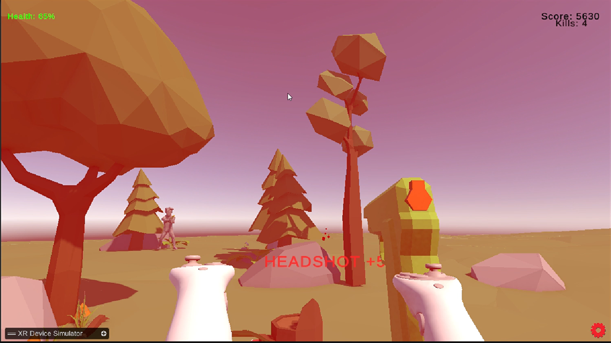

# 🎮 VR Shooter Game

## 🔹 Overview
A VR-based shooter game built using Unity where the player fights enemies in timed and wave-based modes.

## 🚀 Features
- Wave-based enemy spawning system
- Headshot detection (instant kill)
- Enemy AI with NavMesh
- Weapon system (pistol, rifle)
- Game state system (Gameplay, Pause, GameOver)

## 🧠 Tech Used
- Unity Engine
- C#
- XR Interaction Toolkit
- NavMesh AI

## 🏗 Architecture
- Singleton Pattern (GameManager, UIManager, Stats)
- Observer Pattern (events)
- Interface-based damage system (IDamage)
- State Machine (Game states)

## 🎮 Controls
- VR controllers (XR Toolkit)

## 🎯 What I Learned
- Game architecture design
- AI behavior handling
- VR interaction system
- Event-driven programming

## 📸 Screenshots

## 🎥 Gameplay Video
(Add YouTube link here)

## 📦 Build Download
(Add build link here)